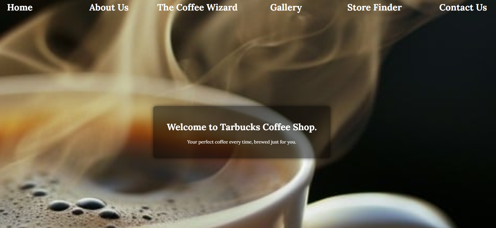
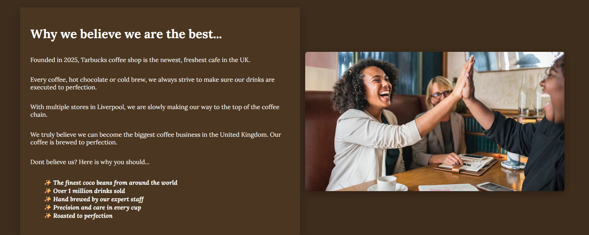
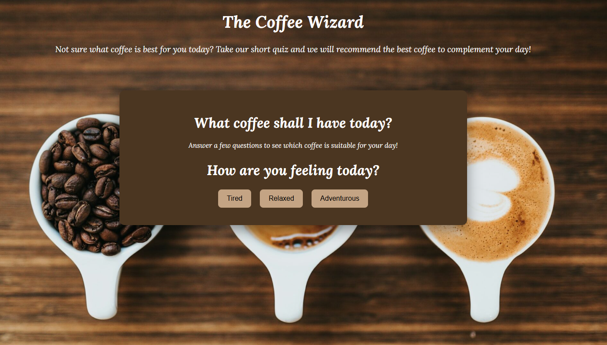
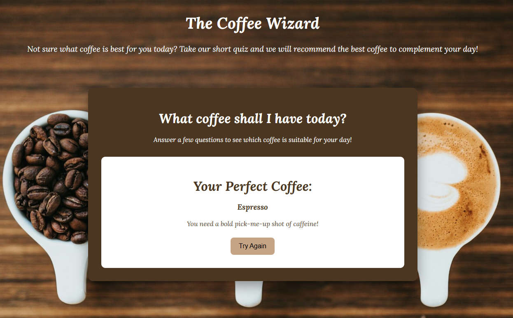
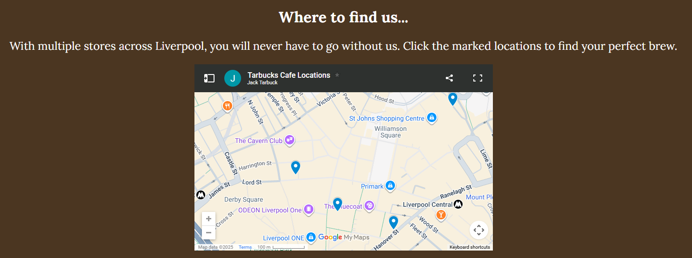

# tarbucks-coffee-concept-website
A coffee shop concept made with HTML, CSS &amp; JavaScript. 

The coffee shop website begins with a introduction and a navbar section. The navbar elements 'shake' when hovered over.

Moving on, there is a 'about us' section highlighting the companies success.

The next section I am quite proud of, it is a 'what coffee is best for me today' quiz.
You answer a series of questions and the website tells you what coffee is suitable for you.
Originally I made this with React. However I had to convert it back to vanilla JavaScript.
It has still come out working and looking fabulous though.

Moving further on, there is a selection of images.
After this, there is a 'store finder' section which shows you where the cafes are located in the UK.
Obviously the cafe does not exist, so I amended some Liverpool lunch spots and turned them into 'Tarbucks Cafe'

The website finishes with an interactive links section.
The links currently don't link to anything as the company does not exist.

Very happy with this one! Feels like a nice step towards making clean, presentable websites!

